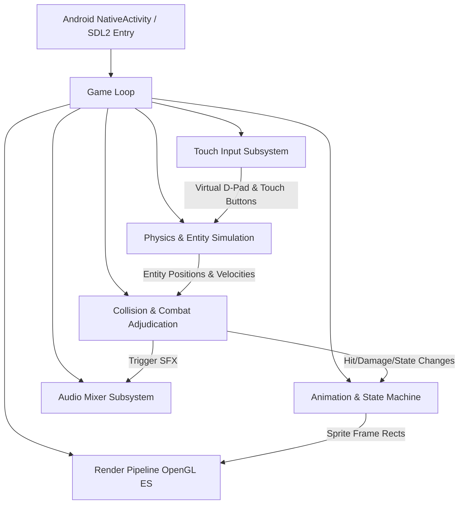
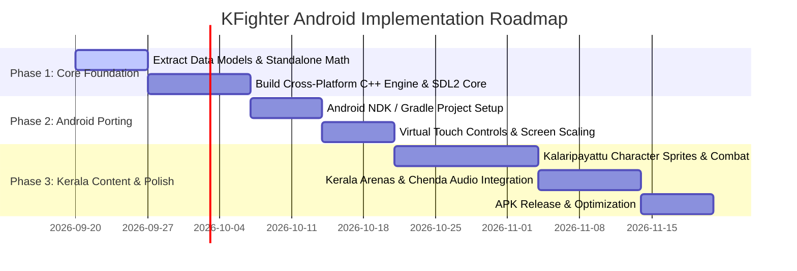

# KFighter Design Document

> **Living Document Notice:** This design document must be maintained and updated every time architectural changes, engine refactorings, or content additions are made to the repository.

---

## 1. Executive Summary & Vision

**KFighter** is an Android-native 2.5D beat-'em-up combat game inspired by the legendary *Little Fighter 2 (LF2)* mechanics, reimagined with rich **Kerala folklore, culture, and Kalaripayattu martial arts**.

The ultimate goal of this project is to provide a smooth, modern Android gaming experience (targeting modern Android versions, API level 34+, 60 FPS, responsive touch/gamepad controls) packaged as an installable APK, running on a clean, portable native game engine derived from the mathematical and state-machine principles of Little Fighter 2.

```
+-------------------------------------------------------------------------+
|                              KFighter (APK)                             |
+-------------------------------------------------------------------------+
|   Kerala Cultural Theme, Kalaripayattu Fighters, Traditional Stages     |
+-------------------------------------------------------------------------+
|                  KFighter Game Engine (Portable C++20)                  |
|  - LF2 Data Loader (.dat parser / JSON)   - 2.5D Coordinate System      |
|  - ITR / BDY Hitbox Collision Engine      - Frame & State Machines      |
|  - Virtual On-Screen Gamepad & Input      - Audio & SFX Mixer           |
+-------------------------------------------------------------------------+
|                       Platform Abstraction Layer                        |
|  - SDL2 / OpenGL ES 3.0 / EGL             - OpenSL ES / AAudio          |
+-------------------------------------------------------------------------+
|                     Android NDK / OS Runtime (ARM64)                    |
+-------------------------------------------------------------------------+
```

---

## 2. Codebase Archaeology & Legacy Analysis

The upstream repository (`openlf2`) is a specialized reverse-engineering / binary hooking project designed to intercept and hook functions inside the 32-bit Windows PE executable of *Little Fighter 2 v2.0a* (`openlf2.exe`).

### 2.1 Key Components in Legacy Codebase

1. **`src/openlf2.c` & `src/util.c`**:
   - Implements Win32 DLL injection and in-memory function patching via `VirtualProtect` and x86 5-byte `JMP` (`\xE9`) / `CALL` (`\xE8`) overwrites.
   - Injects hooks into:
     - `func_403270_teleport`: Rudolf's teleportation mechanics.
     - `func_417170_random`: LF2's proprietary pseudo-random number generator.
     - `func_417400_does_attack_success`: The master hit detection and collision adjudication function.

2. **The Memory Layout Blueprints (`include/*.h`)**:
   These headers represent an exact reverse-engineered memory map of LF2's runtime data structures:
   - **`include/global.h`**: The central world state (`global_t`), storing pointers to up to 400 active entities (`objects[400]`), active object bitmasks, game state flags, and table of 65 loaded `.dat` data files.
   - **`include/object.h`**: The master entity structure (`object_t`). Contains:
     - Spatial coordinates: 2.5D world position (`x`, `y`, `z`), sub-pixel floating positions (`x_position`, `y_position`, `z_position`), velocities (`x_velocity`, `y_velocity`, `z_velocity`), and accelerations (`y_accl`, `z_accl`).
     - State tracking: current frame IDs (`frame_id1` through `frame_id4`), facing direction (`facing`), wait counters, action timers, caught/catcher IDs.
     - Combat stats: HP, MP, Dark HP, Max HP, loss metrics, kill counters, weapon associations.
     - Input buffers: `holding_*` flags, `click_*` triggers, and composite key combination buffers (e.g., `click_DRA`, `click_DLA`, `click_DUA`, `click_DDA`, `click_DRJ`, `click_DJA`).
   - **`include/frame.h`**: Represents individual animation frames (`frame_t`), defining:
     - State identifiers, duration (`wait`), next frame pointers (`next`).
     - Branching triggers for user inputs: `hit_a`, `hit_d`, `hit_j`, `hit_Fa`, `hit_Ua`, `hit_Da`, `hit_Fj`, `hit_Uj`, `hit_Dj`, `hit_ja`.
     - Specialized coordinate attachment points:
       - `opoint_t`: Object spawning point (projectiles, weapons, effects).
       - `bpoint_t`: Blood/hit spark emitter coordinate.
       - `cpoint_t`: Catching / caught anchor point with throwing physics parameters.
       - `wpoint_t`: Weapon hold position and swing orientation.
     - Hitboxes & Hurtboxes: dynamic arrays of `itr_t` (interaction boxes) and `bdy_t` (body boxes).
   - **`include/itr.h` & `include/bdy.h`**:
     - `itr_t` defines attack kind (normal attack, heal, catch, flute, freeze, etc.), dimensions, damage (`injury`), knockback velocities (`dvx`, `dvy`), hit effects, and rest frames (`arest`, `vrest`).
     - `bdy_t` defines collision receiver boundaries on the target.
   - **`src/class_global.c`**:
     - Contains the reverse-engineered `func_417400_does_attack_success` logic, establishing the exact conditions under which an attack connects, including team checks, invincibility frames, catching eligibility, and elemental interactions (fire vs. freeze).

### 2.2 Why the Legacy Architecture Cannot Run on Android

- The legacy project is **not a standalone game engine**; it is an x86 Win32 DLL patcher that hooks hardcoded memory addresses (`0x00403270`, `0x00458B00`, etc.) in the closed-source Windows binary `openlf2.exe`.
- Modern Android devices run on **ARM64 (aarch64)** processors with Linux kernels and ART runtimes. Windows PE binaries and x86 hook offsets cannot be executed or patched natively on Android.
- **Architectural Solution:** We utilize the reversed data structures, mathematical formulas, collision tables, and state machine algorithms as the ground-truth specification to build a clean, cross-platform standalone engine using C++20 and SDL2/OpenGL ES for Android.

---

## 3. KFighter Target Architecture

### 3.1 Technology Stack

| Layer | Component / Technology | Purpose |
|---|---|---|
| **OS / Packaging** | Android SDK / Gradle / NDK (r26+) | APK packaging, lifecycle management, asset streaming |
| **Platform / Windowing** | SDL2 (or SDL3) for Android | NativeActivity glue, touch events, audio output, EGL context |
| **Graphics Engine** | OpenGL ES 3.0 / 2D Sprite Batcher | Hardware-accelerated 2D rendering, custom shaders, alpha blending |
| **Audio Engine** | SDL_mixer / OpenSL ES / Ogg Vorbis | Multi-channel sound effects (weapons, hits, chants) & streaming BGM |
| **Game Logic** | Modern C++20 Standard | Deterministic physics, state machine, collision system, AI |
| **Data Format** | LF2 .dat / Modern JSON Asset Pipeline | Frame descriptions, hitboxes, character attributes, stage layouts |

### 3.2 Subsystem Breakdown



1. **Virtual Touch Controller**:
   - On-screen touch controls optimized for mobile gameplay:
     - Left thumb: Responsive virtual 8-direction D-pad / analog stick.
     - Right thumb: Action cluster consisting of **Attack (A)**, **Jump (J)**, **Defend (D)**.
     - Quick-cast gesture / macro buttons for special move inputs (e.g. `D+>+A`, `D+^+J`).

2. **Entity & Object Engine**:
   - Standalone C++ implementation of the 2.5D coordinate model (`x`, `y`, `z`).
   - Ground plane depth simulation (`z` axis) with shadow projection.
   - Gravity, terminal velocity, friction, and wall/boundary collision.

3. **Collision & Combat Engine**:
   - Multi-layer Axis-Aligned Bounding Box (AABB) intersection in 3D:
     - Horizontal/vertical overlap: `X` and `Y` intersection.
     - Depth tolerance: `|z1 - z2| <= zwidth`.
   - Interaction resolution based on `itr_t` and `bdy_t` specifications extracted from LF2.
   - Invulnerability frames, hitstun, knockback trajectories, falling states.

4. **Asset & Resource Pipeline**:
   - High-resolution or pixel-art sprite sheets with JSON / .dat descriptors.
   - Texture atlas management avoiding runtime fragmentation.
   - Audio decoding for low-latency SFX playback.

---

## 4. Kerala Cultural Theme & Lore Design ("KFighter")

### 4.1 Theme Overview
The visual identity, narrative, characters, and soundscape of Little Fighter 2 are reimagined around **God's Own Country (Kerala)**, drawing from ancient martial arts, coastal landscapes, temple festivals, and historical warrior legends (*Vadakkan Pattukal*).

### 4.2 Characters & Martial Archetypes

| Character | Inspiration / Folklore | Fighting Style & Weapons | Special Moves |
|---|---|---|---|
| **Aromal** | *Aromal Chekavar*, legendary warrior of North Malabar | Kalaripayattu master; dual Churika (curved daggers) and sword | Swift horizontal dash strike, rising blade arc, whirlwind slash |
| **Othenan** | *Thacholi Othenan*, heroic master of Kadathanad | High-agility Kalaripayattu; Vadithallu (bamboo staff) | Vaulting staff sweep, mid-air staff slam, counter-parry |
| **Unniyarcha** | *Unniyarcha*, fearsome female Chekavar warrior | Lethal master of the **Urumi** (flexible steel whip-sword) | Long-range 360-degree whipping flourish, spiral coil strike, defensive blade ring |
| **Thekkedathu Asuran** | Kathakali *Kathi Vesham* (Demonic warrior-king) | Heavy brutal strength, mystical fury | Stomp shockwave, fiery trident thrust, terrifying roaring burst |
| **Velichappad** | The sacred oracle / medium | Ritual curved sword (Chilambu & sword), trances | Trance berserk speed, ringing bell disorientation, sweeping holy strike |
| **Theyyam Guardian** | Sacred ritual dancer of North Kerala | Fierce acrobatics, fire torches | Dual fire torch charge, blazing spinning leap, divine shield |

### 4.3 Traditional Kerala Arenas / Stages

1. **Kalari Gurukulam (Traditional Training Arena)**:
   - Dug-in earthen floor, red clay walls, traditional lamps (*Nilavilakku*), weapons racks lined with spears, shields, and urumis.
2. **Alappuzha Backwaters & Kettuvallam**:
   - Floating combat platform atop interconnected wooden houseboats with palm trees, coconut groves, and calm rippling waters in the background.
3. **Thrissur Pooram Temple Grounds**:
   - Caparisoned elephants, golden parasols (*Muthukkuda*), sea of festive spectators, fireworks sparks, and vibrant temple architecture.
4. **Wayanad Mist-Clad Rainforest**:
   - Ancient mossy stones, bamboo bridges, cascading waterfalls, tropical foliage, and misty mountain ridges.
5. **Bekal Coastal Fort**:
   - Massive laterite battlements overlooking the crashing waves of the Arabian Sea under golden sunset skies.

### 4.4 Sound & Music Aesthetic
- **Percussion Core**: Live energetic rhythms driven by **Chenda** (*Uruttu Chenda* for battle intensity), **Thimila**, **Maddalam**, and **Elathalam** cymbals.
- **Atmospheric Melodies**: Mystical resonance from the **Idakka**, conch horn (*Shankham*) battle cries, and traditional temple horns (*Kombu*).
- **Voice Lines & SFX**: Authentic battle grunts and martial shouts rooted in Malayalam warrior tradition (*Hai!*, *Hoi!*, *Chuvadu!*).

---

## 5. Development Roadmap & Milestones



- **Phase 1: Architecture & Standalone Engine Foundation (COMPLETED)**
  - Translated reverse-engineered C data structures into modern C++20 domain headers:
    - [`types.hpp`](file:///c:/Users/ssro2/Desktop/Projects/Android/LF2/engine/include/kfighter/types.hpp): `Vec3f`, `Vec2i`, `Facing`, `Team`, `EntityType`.
    - [`hitbox.hpp`](file:///c:/Users/ssro2/Desktop/Projects/Android/LF2/engine/include/kfighter/hitbox.hpp): `Hitbox` (`itr`), `Hurtbox` (`bdy`), `WorldBox` with 2.5D depth intersection.
    - [`frame.hpp`](file:///c:/Users/ssro2/Desktop/Projects/Android/LF2/engine/include/kfighter/frame.hpp): `Frame`, input branching triggers (`hit_a`, `hit_j`, `hit_d`), anchors (`opoint`, `bpoint`, `wpoint`).
    - [`entity.hpp`](file:///c:/Users/ssro2/Desktop/Projects/Android/LF2/engine/include/kfighter/entity.hpp): `Entity` state machine, 2.5D position/velocity, HP/MP, timers, and default fighter frames.
    - [`collision.hpp`](file:///c:/Users/ssro2/Desktop/Projects/Android/LF2/engine/include/kfighter/collision.hpp) & [`collision.cpp`](file:///c:/Users/ssro2/Desktop/Projects/Android/LF2/engine/src/collision.cpp): Full implementation of `func_417400_does_attack_success` (depth filtering, friendly fire, invulnerability, guard damage reduction).
    - [`world.hpp`](file:///c:/Users/ssro2/Desktop/Projects/Android/LF2/engine/include/kfighter/world.hpp) & [`world.cpp`](file:///c:/Users/ssro2/Desktop/Projects/Android/LF2/engine/src/world.cpp): Fixed-timestep simulation tick loop, arena boundary clamping, pairwise combat resolution, and event logging.
  - Implemented and passed 100% of automated unit test suites:
    - [`test_collision.cpp`](file:///c:/Users/ssro2/Desktop/Projects/Android/LF2/tests/src/test_collision.cpp): 5 tests covering 2.5D depth filtering, friendly fire immunity, invulnerability frames, damage/knockback calculation, and directional guard mechanics.
    - [`test_physics.cpp`](file:///c:/Users/ssro2/Desktop/Projects/Android/LF2/tests/src/test_physics.cpp): 3 tests covering gravity, ground landing at `y=0`, friction deceleration, and arena wall clamping.
  - Built interactive desktop test harness with SDL2 ([`main.cpp`](file:///c:/Users/ssro2/Desktop/Projects/Android/LF2/desktop/src/main.cpp)) rendering 2.5D perspective grid, depth shadows, color-coded hurtboxes/hitboxes, impact sparks, and dual HP HUD.
- **Phase 2: Android Porting & Rendering Pipeline (NEXT)**
  - Configure Android NDK / CMake build harness with Android Studio / Gradle.
  - Integrate SDL2 Android `NativeActivity` glue and EGL/OpenGL ES 3.0 renderer.
  - Implement on-screen touch controller with multi-touch virtual D-Pad and action buttons (A, J, D).
- **Phase 3: Kerala Theme Integration**
  - Implement Kerala character data definitions, sprite sheets, and animations.
  - Build Kerala stages with parallax scrolling backgrounds.
  - Implement audio manager for Chenda melam rhythms and combat sound effects.
- **Phase 4: Optimization & APK Release**
  - Target Android API 34+ (Android 14/15) with 64-bit ARM binaries (`arm64-v8a`).
  - Memory profiling, frame-time stabilization to 60 FPS, battery optimization.
  - Final signed debug/release APK generation.

---

## 6. Living Document Update Protocol

Every developer or agent working on this codebase must adhere to the following rule:
> **MANDATORY:** When any change is introduced—whether code refactoring, new subsystem implementation, Android build modification, or Kerala asset addition—**this design document must be immediately updated** to reflect the new state, architectural decisions, and updated component designs.
